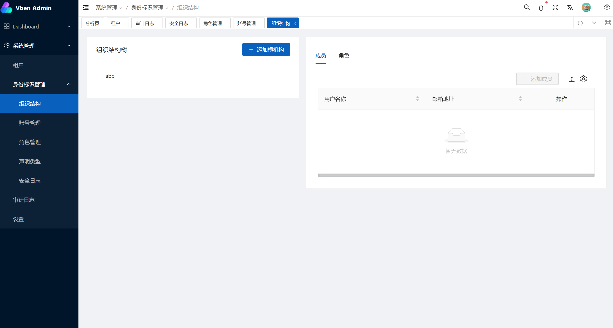
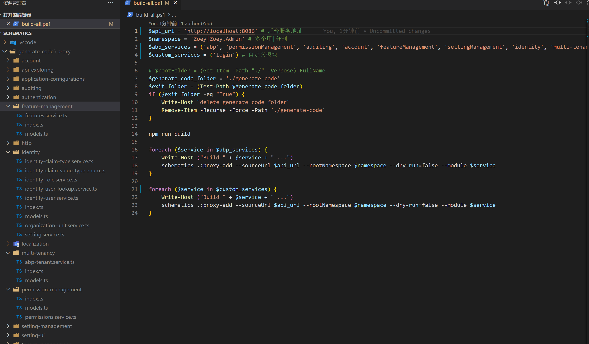

# abp-vue

本项目参照[colinin](https://github.com/colinin/abp-vue-admin-element-typescript)

本项目为单体应用并且移除了 _IdentityServer4_ 使用 _jwt_

## 后端

[abp vnext](https://github.com/abpframework/abp)

运行

1. 修改**Zoey.Admin.HttpApi.Host**的**appsettings.json**数据库连接字符串
2. 初始化数据库，在**Zoey.Admin.HttpApi.Host**项目下执行```dotnet ef database update```命令
3. 运行**Zoey.Admin.HttpApi.Host**

## 前端

[vben](https://vvbin.cn/next/#/dashboard/analysis)

运行

```
cd ./vben-admin

# 安装依赖
yarn

# 运行项目
yarn serve
```

## 

## 代码生成器

修改官方代码生成器以支持vue3 + TypeScript

1. 运行schematics/build-all.ps1 （运行前请确保后端服务已启动）

2. 把generate-code/proxy的文件拷到vben-admin的src/api/proxy中

生产结构如下：


